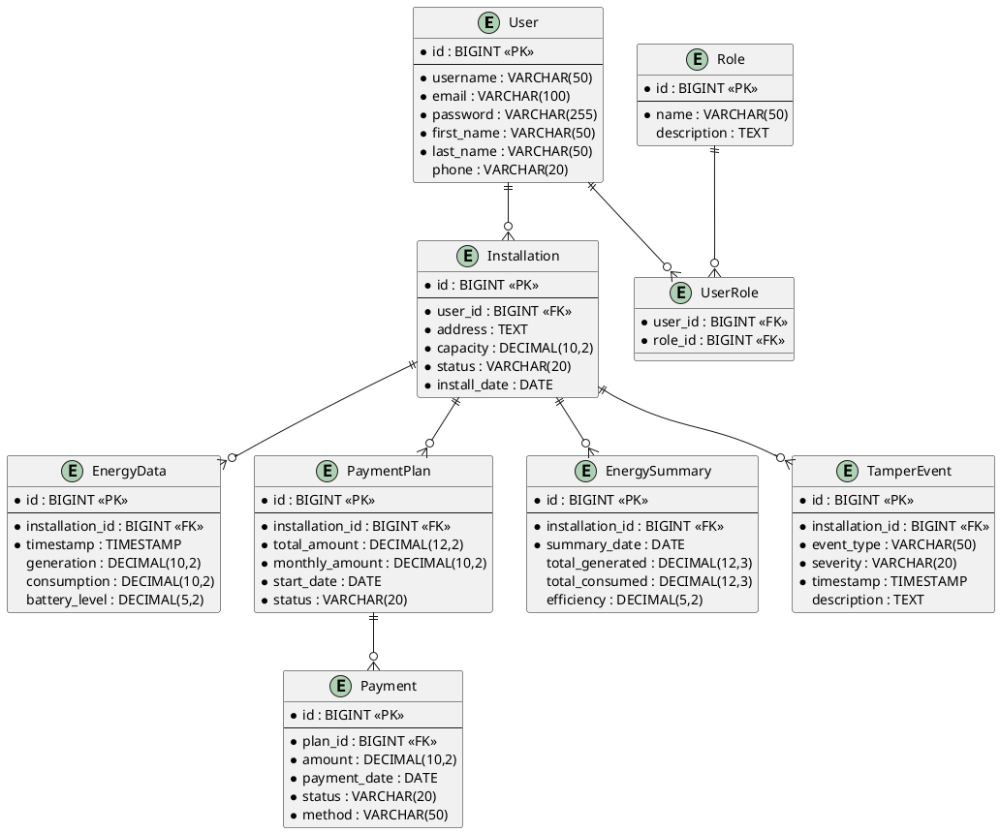
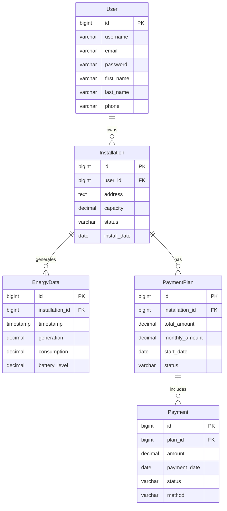

# Entity-Relationship Diagram Creation Options

## Current Issue
The ASCII diagram in the LaTeX document has formatting issues and poor visual quality. Here are better alternatives:

## Option 1: Draw.io (Recommended - Free & Easy)
**Best for:** Quick, professional diagrams
**Website:** https://app.diagrams.net/

### Steps:
1. Go to app.diagrams.net
2. Choose "Create New Diagram"
3. Select "Entity Relationship" template
4. Create entities with the following structure:

```
User
- id (PK)
- username
- email
- password
- first_name
- last_name
- phone

Installation
- id (PK)
- user_id (FK)
- address
- capacity
- status
- install_date

EnergyData
- id (PK)
- installation_id (FK)
- timestamp
- generation
- consumption
- battery_level

PaymentPlan
- id (PK)
- installation_id (FK)
- total_amount
- monthly_amount
- start_date
- status

Payment
- id (PK)
- plan_id (FK)
- amount
- payment_date
- status
- method

Role
- id (PK)
- name
- description

EnergySummary
- id (PK)
- installation_id (FK)
- summary_date
- total_generated
- total_consumed
- efficiency

TamperEvent
- id (PK)
- installation_id (FK)
- event_type
- severity
- timestamp
- description
```

### Relationships:
- User → Installation (1:N)
- Installation → EnergyData (1:N)
- Installation → PaymentPlan (1:N)
- PaymentPlan → Payment (1:N)
- Installation → EnergySummary (1:N)
- Installation → TamperEvent (1:N)
- User ↔ Role (M:N)

## Option 2: Lucidchart (Professional)
**Best for:** High-quality diagrams with advanced features
**Website:** https://lucidchart.com
**Cost:** Free tier available, paid plans for advanced features

## Option 3: MySQL Workbench (Database-Specific)
**Best for:** Technical database diagrams
**Free:** Yes
**Download:** https://www.mysql.com/products/workbench/

### Steps:
1. Install MySQL Workbench
2. Create new Model
3. Add tables with fields
4. Define relationships
5. Export as PNG/PDF

## Option 4: Visual Studio Code with Extensions
**Best for:** Developers who prefer text-based diagrams

### Extensions:
- PlantUML
- Mermaid Preview

### PlantUML Code:


## Option 5: Mermaid (For Web/Markdown)
**Best for:** Documentation that needs to be version-controlled



## Recommendation
**For your thesis, I recommend Draw.io because:**
1. **Free and accessible** - No installation required
2. **Professional output** - Clean, publication-quality diagrams
3. **Easy to use** - Drag and drop interface
4. **Export options** - PNG, PDF, SVG for LaTeX inclusion
5. **Collaborative** - Can share and get feedback

## Next Steps
1. Create the diagram in Draw.io
2. Export as PNG or PDF
3. Replace the ASCII diagram in your LaTeX document with:

```latex
\begin{figure}[h]
    \centering
    \includegraphics[width=\textwidth]{images_2/er_diagram.png}
    \caption{Entity-Relationship Diagram for Solar Energy Monitoring and Control System Database}
    \label{fig:er-diagram}
\end{figure}
```

This will give you a much more professional and readable diagram for your thesis.
